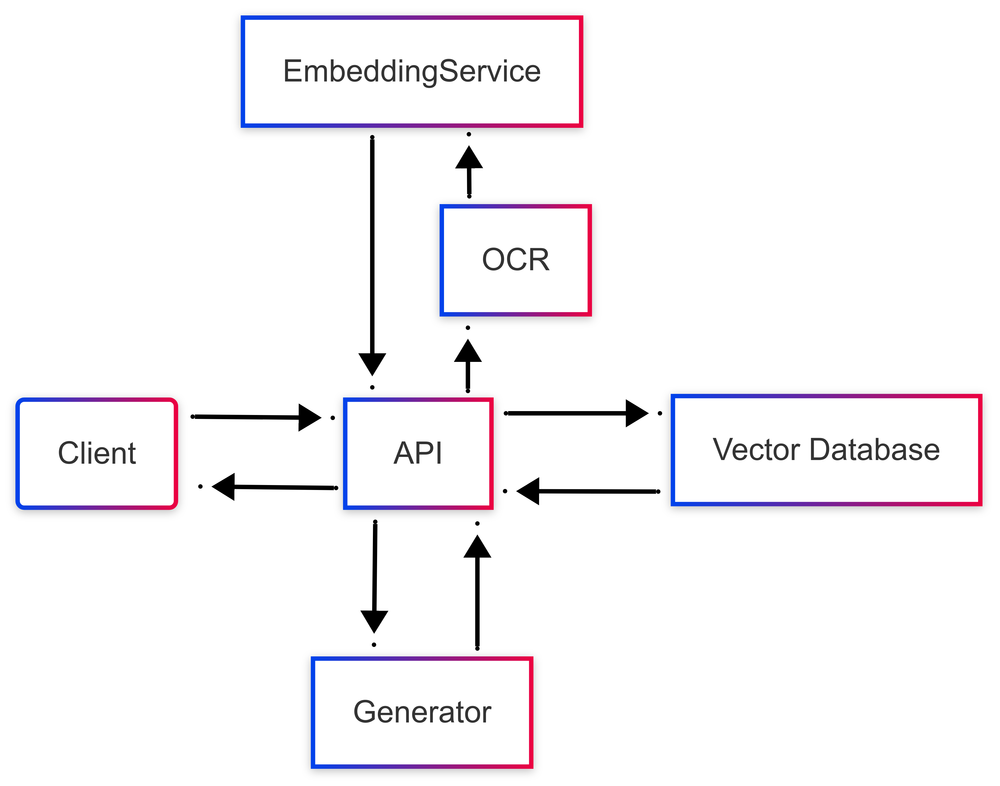

# RAG Project

## Overview
This Docker-based Retrieval-Augmented Generation (RAG) system integrates Tesseract OCR, Chroma DB for vector embeddings, and an API for document processing and service integration. With support for Ollama-based embedding models, it can operate fully offline, ensuring secure handling of sensitive data.

---

## Features

- **Document Collections Management**:
  - Create, retrieve, and delete document collections.
  - Add multiple documents to a collection.
- **Embeddings Management**:
  - Generate embeddings for documents using configurable embedding models.
  - Query documents based on vector similarity.
- **Document prcessing**:
  - .pdf files preprocessing and OCR.
  - Cleanup and chunking documents.
  - Chunks embedding.
  - Chroma DB for fast and scalable vector search.
- **Supported Embedding Models**:
  - OpenAI
  - Ollama

---

## Structure


---

## Getting Started

### Prerequisites

- Docker installed on your machine

### Setup Instructions

1. **Clone the Repository**:

   ```bash
   git clone https://github.com/KrzysztofTybinka/DocMiner
   cd <repository-folder>
   ```

2. **Configure the Environment**:

   - Update `appsettings.json` in the `RAG` folder with your embedding model settings. Example:
     ```json
     "EmbeddingModelSettings": {
       "ProviderName": "Ollama",
       "ModelName": "mxbai-embed-large",
       "Token": null,
       "Url": "http://localhost:11434/v1/embeddings"
     }
     ```
   - Make sure swagger is enabled:
     ```json
     "SwaggerSettings": {
       "EnableSwagger": true
     }
     ```

3. **Run Docker Compose**:

   ```bash
   docker-compose up --build
   ```

   - Services will run on the following ports:
     - **OCR API**: `http://localhost:8081`
     - **RAG API**: `http://localhost:8080`
     - **Chroma DB**: `http://localhost:8000`

4. **Verify Services**:

   - Access the RAG API Swagger documentation at `http://localhost:8080/swagger`.

---

## Usage

### 1. Document Collection Endpoints

- **Create collection**:
  ```http
  POST /DocumentCollection
  {
    "collectionName": "example-collection"
  }
  ```
  Parameter | Type | Required | Description
  --- | --- | --- | --- |
  CollectionName | String | Yes | Name of a collection that will be created.
  
- **List all collections**:
  ```http
  GET /DocumentCollections
  ```
  
- **Delete collection**:
  ```http
  DELETE /DocumentCollection/{collectionName}
  ```
  Parameter | Type | Required | Description
  --- | --- | --- | --- |
  CollectionName | String | Yes | Name of a collection that will be deleted.

### 2. Embedding Endpoints

- **Add Document to Collection**:
  ```http
  POST /Embeddings
  {
    "collectionName": "example-collection",
    "numberOfTokens": "50"
    "filePath": "path/to/document.pdf"
  }
  ```
  Parameter | Type | Required | Description
  --- | --- | --- | --- |
  CollectionName | String | Yes | Name of a collection where the document will be uploaded.
  NumberOfTokens | Int | Yes | Number of tokens will be used to chunk document. More tokens, more context in one chunk.
  FilePath | String | Yes | Path to the document that will be uploaded.
  
- **Query Collection**:
  ```http
  POST /QueryEmbeddings
  {
    "collectionName": "example-collection",
    "prompts": ["search query", "second query"],
    "Nresults": 10
  }
  ```
  Parameter | Type | Required | Description
  --- | --- | --- | --- |
  CollectionName | String | Yes | Name of a collection to be queried.
  Prompts | Array | Yes | Prompts to query the collection.
  Nresults | Int | Yes | Number of query results, sorted by most similar to the least similar.
  
- **Get Embeddings**:
  ```http
  GET /Embeddings?CollectionName=example-collection&WhereDocumentNames=doc1
  ```
  Parameter | Type | Required | Description
  --- | --- | --- | --- |
  CollectionName | String | Yes | Name of a collection to be queried.
  WhereDocumentNames | Array | No | Returns chunks related to the specified documents.
  WhereChunkIds | Array | No | Returns chunks related to the specified IDs.
  
- **Delete Embedding**:
  ```http
  DELETE /Embeddings?collectionName=example-collection&whereDocumentNames=doc1,doc2&whereChunkIds=e0984299-ac54-40a0-9d01-8d85b135f2c6
  ```
    Parameter | Type | Required | Description
  --- | --- | --- | --- |
  CollectionName | String | Yes | Name of the collection from which embeddings will be deleted.
  WhereDocumentNames | Array | No | A list of document names whose embeddings should be deleted.
  WhereChunkIds | Array | No | A list of chunk IDs whose embeddings should be deleted.

---

## Licensing

This project is licensed under the MIT License. See [LICENSE](LICENSE) for details.

---

## Contributions

Contributions, issues, and feature requests are welcome. Please open an issue or submit a pull request to contribute.

---

